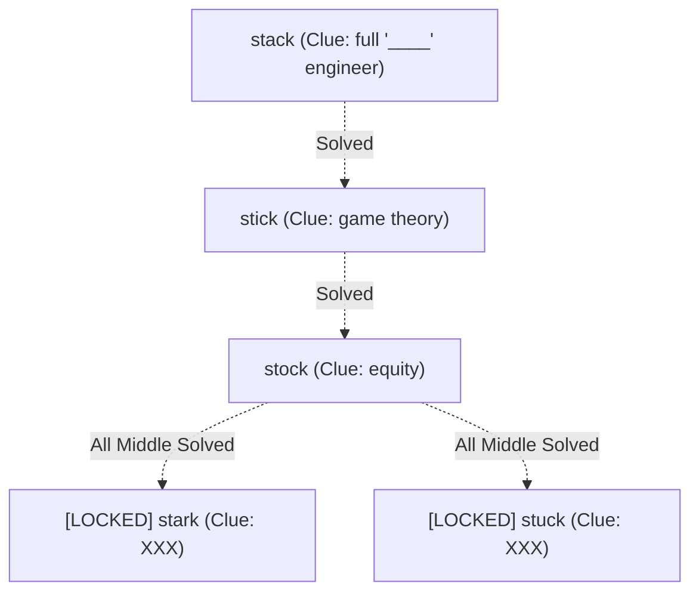

# Design: LinkedIn Games Riddles

This document outlines the design for the LinkedIn-inspired riddles: **Crossclimb** and **Pinpoint**.

## 1. Crossclimb

A word ladder game where the user must fill in words that differ by exactly one letter from the previous word.

### Logic & State
- **Words**:
  - `stark` (Top) [LOCKED]
  - `stack` (Middle)
  - `stick` (Middle)
  - `stock` (Middle)
  - `stuck` (Bottom) [LOCKED]
- **Locking Mechanism**:
  - The "Top" (`stark`) and "Bottom" (`stuck`) words are disabled and visually dimmed initially.
  - The middle words (`stack`, `stick`, `stock`) must be correctly filled first (order doesn't matter, but all 3 must be filled).
  - Once all 3 middle words are correct, the top and bottom words unlock for input.

### UI Representation
- **Top + Bottom Hint**: "The Company" (Stark + Stuck? Maybe "Iron Man" related?).

### Components
- `CrossclimbStage`: Manages the overall logic and progress.
- `LadderRow`: Renders a single clue and its corresponding `CharacterInput`.

---

## 2. Pinpoint

A category guessing game where clues are revealed one by one.

### Clue Sequence
1.  **chocolate**
2.  **spy**
3.  **steel art**
4.  **natural history**
5.  **city of prague**

**Answer**: `Museum`

### Logic & State
- **Current Clue Index**: Starts at 1.
- **Reveal Logic**: User can reveal next clue (with potential cooldown).
- **Guessing**: An input field is always available for the user to try the answer.

## 3. Implementation Details

- **Feature Directory**: `src/features/riddles/linkedin/`
- **Main Entry**: `LinkedInGames.tsx`
- **Shared Components**: Use `CharacterInput` and `TextAnswerStage` where possible.

## 4. Verification

### Test Cases
- **Crossclimb**:
  - Verify that `stark` and `stuck` inputs are `disabled` on initial mount.
  - Verify that after `stack`, `stick`, and `stock` are entered correctly, `stark` and `stuck` become enabled.
- **Pinpoint**:
  - Verify that clues are revealed in the correct order.
  - Verify "Museum" is accepted (case-insensitive).
